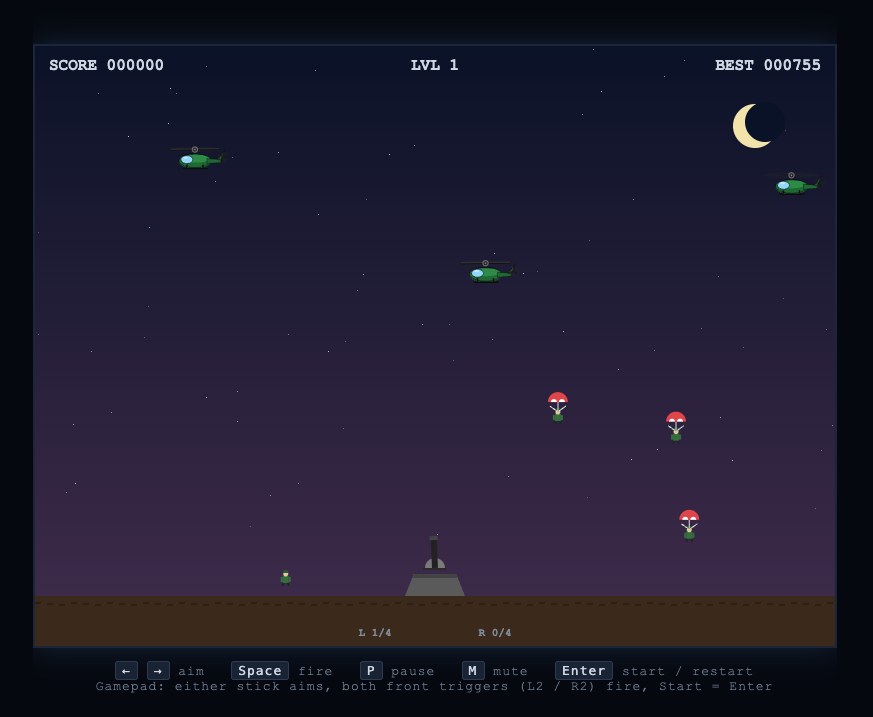

# Paratrooper

A browser remake of the classic 1982 arcade game *Paratrooper*, inspired by
[denix666/paratrooper](https://github.com/denix666/paratrooper). Single HTML
file, vanilla JavaScript, HTML5 Canvas — no build step, no dependencies.

**[▶ Play online](https://begoon.github.io/paratrooper)**



## Run

Play it directly at <https://begoon.github.io/paratrooper>, or open
`index.html` locally in any modern browser — that's it, no build step.

```bash
open index.html        # macOS
xdg-open index.html    # Linux
start index.html       # Windows
```

If your browser blocks audio until you interact, the first key press unlocks
sound.

## How to play

You command an anti-aircraft gun at the center of the screen. Helicopters fly
across the sky from both sides and drop paratroopers. Shoot the helicopters,
or shoot the paratroopers (or their parachutes — they die from the fall if
the chute opens too low).

Survivors who land safely walk toward your bunker and start stacking against
its walls. **If four pile up on either side, the top one climbs over the gun
and it's game over.**

## Controls

### Keyboard

| Key                  | Action          |
| -------------------- | --------------- |
| `Left` / `Right`     | Aim the turret  |
| `Space`              | Fire            |
| `Enter`              | Start / restart |
| `P`                  | Pause           |
| `M`                  | Mute / unmute   |

### Gamepad (Xbox / PlayStation / generic)

| Input                       | Action                          |
| --------------------------- | ------------------------------- |
| Left stick or right stick   | Aim — gun follows stick angle   |
| L2 / R2 (front triggers)    | Fire                            |
| Start                       | Start / restart / pause toggle  |

The harder-pushed stick wins. Pushing the stick downward is ignored so the
gun can't fire into the ground.

## Scoring

| Target                                    | Points |
| ----------------------------------------- | -----: |
| Helicopter                                |     25 |
| Paratrooper in flight (chute or freefall) |     20 |
| Walking paratrooper                       |     15 |
| Stacked / climbing paratrooper            |     50 |
| Shooting open chute (extra)               |     10 |
| Splat from a fatal fall                   |      5 |

Every 300 points the level advances: helicopters spawn faster and fly
quicker. The high score persists in `localStorage`.

## Mechanics worth knowing

- **Bullets sweep with the gun.** Shots in flight are stored as a distance
  along the current barrel ray, so rotating the turret arcs the entire stream
  through the sky — the classic "garden hose" feel.
- **Chutes are targets.** A bullet through an open parachute drops the
  trooper. They survive and walk if they were close to the ground; otherwise
  they splat.
- **The stack is the threat.** Helicopters can be left alone for points
  later, but stacked troopers cannot. The bottom-corner indicators turn red
  at three on a side.
- **Helicopters won't drop directly over the gun**, giving you a sliver of
  fairness while you scramble to aim.

## File layout

```text
paratrooper/
  index.html   # entire game: markup, styles, and JS in one file
  LICENSE
  README.md
```

## License

[MIT](./LICENSE) © 2026 Alexander Demin
